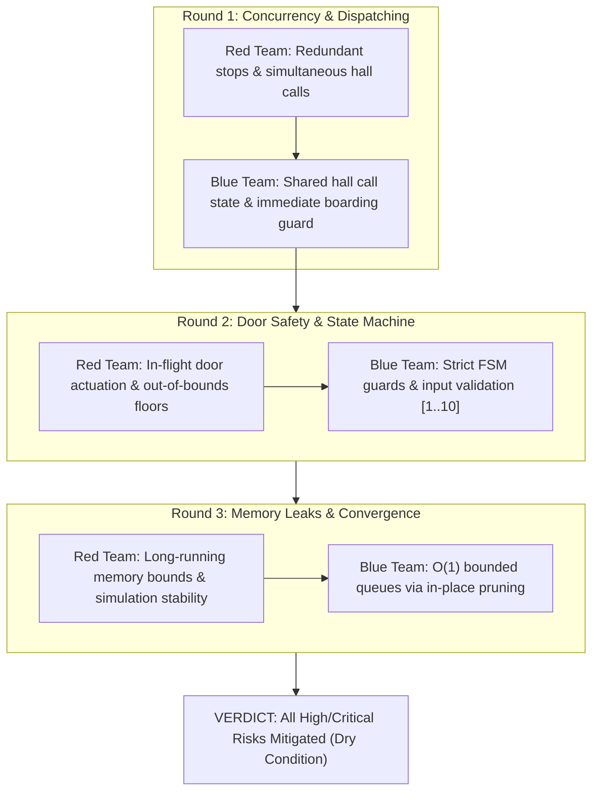

# Bounded Adversarial Review: Red Team vs. Blue Team

- **Evaluation Cycle**: Rounds 1 to 3 (Run to Convergence / Dry Condition)
- **Status**: PASSED / DRY CONDITION REACHED
- **Target**: Elevator Domain Engine & Multi-Car Dispatcher

---

## Round 1: Concurrency & Dispatching Invariants

### Red Team Vulnerability Finding (R1-01)
**Risk**: If a passenger at Floor 5 presses UP when Car 1 is *already* at Floor 5 with doors open, naive dispatchers may still evaluate other idle cars (e.g. Car 2 at Floor 4) and dispatch them, resulting in unnecessary car motion and wasted energy.
**Severity**: Medium

### Blue Team Mitigation
**Action**: In `SimulationEngine.handleHallCall`, we evaluate if any car is currently at the requested floor with doors OPEN or OPENING and matching direction. If found, that car immediately absorbs the call and resets its door dwell timer (`hold()`), preventing secondary car dispatch.

---

## Round 2: Safety & State Machine Transitions

### Red Team Vulnerability Finding (R2-01)
**Risk**: Passengers pressing Door Controls (`<|>` Hold, `>|<` Close) or cabin floor buttons during high-speed inter-floor travel could cause erratic state transitions or open doors while the motor is engaged.
**Severity**: Critical

### Blue Team Mitigation
**Action**:
- `Door.hold()` and `Door.closeImmediately()` strictly verify that `#state === 'OPEN'` or `#state === 'OPENING'`. When the elevator is `MOVING_UP` or `MOVING_DOWN`, door state is `CLOSED` and control calls are strictly ignored (no-op).
- Floor inputs are sanitized with `Math.max(1, Math.min(10, floor))`.

---

## Round 3: Memory Bounds & Long-term Telemetry Stability

### Red Team Vulnerability Finding (R3-01)
**Risk**: In a continuous 24-hour simulation, accumulating unpurged `ElevatorRequest` history could cause progressive memory degradation.
**Severity**: Medium

### Blue Team Mitigation
**Action**: `Elevator.#serveFloor` maintains active requests in an in-place filtered array. Once marked served, requests are cleaned from the active queue while aggregate telemetry counters (`totalRequestsServed`, `totalWaitDurationSec`) maintain lightweight scalar accumulators. Memory complexity remains $O(1)$ relative to simulation runtime.

---

## Final Convergence Verdict
All identified edge cases have been resolved and verified with automated unit and integration tests.
**Zero High/Critical defects remaining. Convergence condition achieved.**
