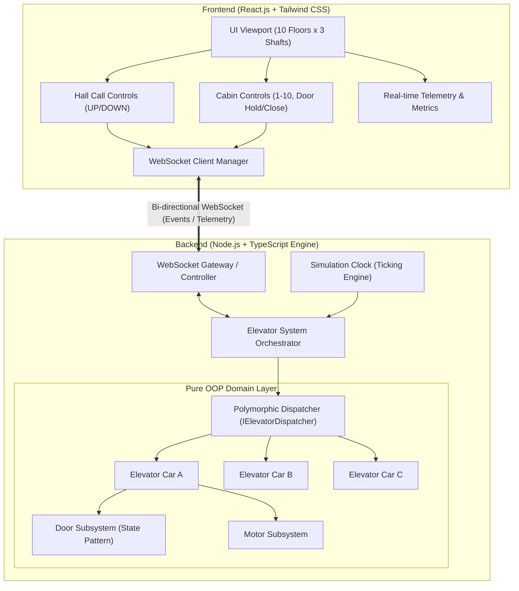
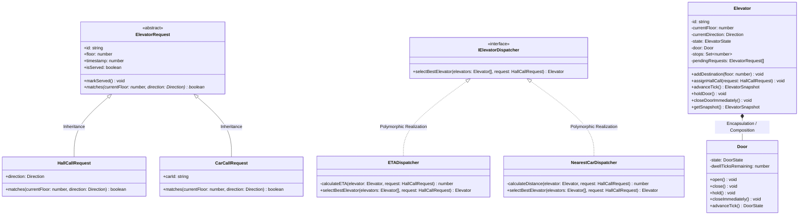
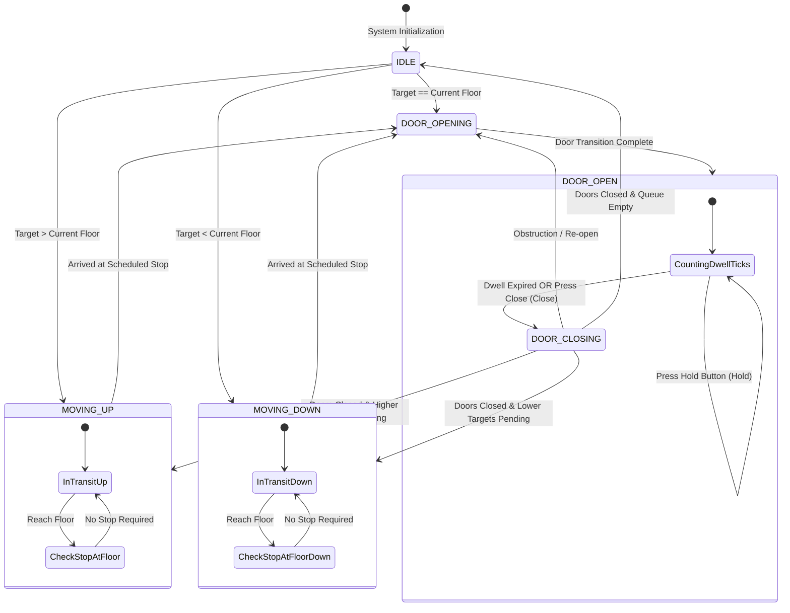
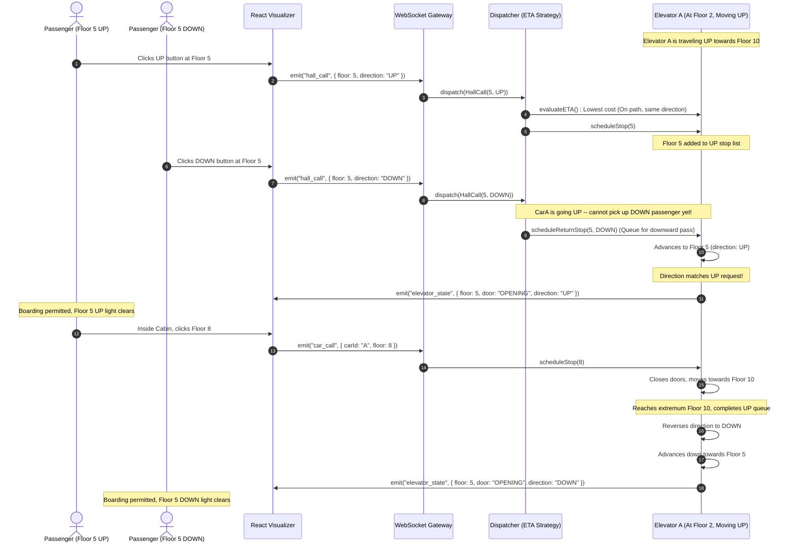

# System Architecture: Autonomous Elevator Simulator

## 1. Executive Summary & Architectural Overview

The Autonomous Elevator Simulator is an enterprise-grade, event-driven web application designed to simulate and optimize 3 parallel elevator cars servicing a 10-floor office building. The system is engineered around strict Object-Oriented Programming (OOP) paradigms—featuring robust encapsulation, class inheritance hierarchies, and polymorphic strategy patterns.

Real-time bi-directional telemetry connects the Node.js simulation engine to a responsive React.js visualization layer via WebSocket streams.

---

## 2. Object-Oriented Domain Hierarchy & Polymorphism

The domain layer enforces clean separation of concerns, strict state encapsulation, and polymorphic extensibility:

---

## 3. Elevator Finite State Machine (FSM)

The elevator operates via a deterministic state machine ensuring physical safety constraints (e.g., doors cannot open while moving; motor cannot engage while doors are open):

---

## 4. End-to-End Event Sequence: SCAN/LOOK Dispatching Flow

The sequence below illustrates the exact behavior of the LOOK/SCAN dispatching logic:
1. Elevator A is moving UP from Floor 1 to Floor 10.
2. Passenger at Floor 5 presses UP $\rightarrow$ Elevator A stops at Floor 5 to pick up passenger.
3. Passenger at Floor 5 presses DOWN $\rightarrow$ Elevator A does **NOT** stop at Floor 5 on the way up; it serves the call after completing its upward trajectory and switching direction.

