# 45-Minute Interview Strategy & Technical Presentation Guide

This guide is structured for the candidate to present the strategy and architectural decisions in the 2nd round interview (45 minutes allocated).

---

## 1. 45-Minute Presentation Time Breakdown

```mermaid
gantt
    title 45-Minute Interview Strategy Roadmap
    dateFormat  m
    axisFormat %M min

    section Presentation (25 min)
    Problem Statement & Constraints     :active, p1, 0, 5m
    Core OOP Architecture & Patterns     :p2, after p1, 8m
    LOOK/SCAN Dispatcher & Math Model    :p3, after p2, 7m
    Live Simulation & Corner-Case Demo   :p4, after p3, 5m

    section Technical Defense & Q&A (20 min)
    Adversarial Edge Cases & Safety      :q1, after p4, 8m
    Scalability & Production Hardening   :q2, after q1, 7m
    Closing & Architecture Retrospective :q3, after q2, 5m
```

---

## 2. Key Talking Points by Section

### Minutes 0–5: Requirements & Domain Invariants
- Context: 3 parallel cars, 10 floors, dynamic concurrent passenger requests.
- The Core Invariant: **Strict Directional Preservation (LOOK/SCAN)**. Explain why naive FIFO or nearest car fails in real buildings (causes car thrashing, high waiting time, and counter-directional passenger confusion).
- Mention the door safety constraints (`<|>` hold vs `>|<` force-close).

### Minutes 5–13: Deep Dive into OOP Architecture
- **Encapsulation**:
  - Show how `Elevator` owns its state machine and stop queue. Internal arrays cannot be mutated directly from outside; mutations occur via command methods (`assignHallCall`, `addDestination`).
- **Inheritance**:
  - Polymorphic base `ElevatorRequest` specialized into `HallCallRequest` (carries direction) and `CarCallRequest` (carries target car).
  - Base `ElevatorState` defining lifecycle transitions.
- **Polymorphism**:
  - `IElevatorDispatcher` interface implemented by `ETADispatcher` and `NearestCarDispatcher`. Highlight how new strategies (e.g. Peak-Morning Ground Priority) can be plugged in without changing a single line of elevator core logic (Open/Closed Principle).

### Minutes 13–20: LOOK/SCAN Dispatcher & Mathematical Model
- Present the ETA cost function formula (refer to `docs/ADR-001-DISPATCHER.md`).
- Walk through the exact interview prompt scenario:
  - Car A moving from Floor 1 to 10.
  - Floor 5 presses UP: Cost is minimal, car stops at 5.
  - Floor 5 presses DOWN: Car will not stop because direction vector does not match; car finishes run to 10 before picking up Floor 5 on the return leg.

### Minutes 20–25: Live Demonstration
- Open React web visualizer.
- Execute live demonstration:
  1. Trigger concurrent calls at Floor 1, Floor 5 UP, and Floor 8 DOWN.
  2. Demonstrate animated car motion and door states.
  3. Click `<|>` to demonstrate door hold.
  4. Click `>|<` to demonstrate immediate door close.
  5. Toggle simulation speed (1x to 5x) to prove deterministic state synchronization.

### Minutes 25–45: Q&A Anticipation & Defense
- **Q**: What happens under high traffic / rush hour?
  - **A**: The system can switch to a Destination Control Dispatcher (DCS) where passengers register destination at the hall, grouping passengers by floor to eliminate multi-floor stops.
- **Q**: How are race conditions prevented between door closing and passenger arrival?
  - **A**: The finite state machine uses atomic transitions guarded by dwell counters. A hall call arriving right as doors are closing will re-trigger the opening state safely.
